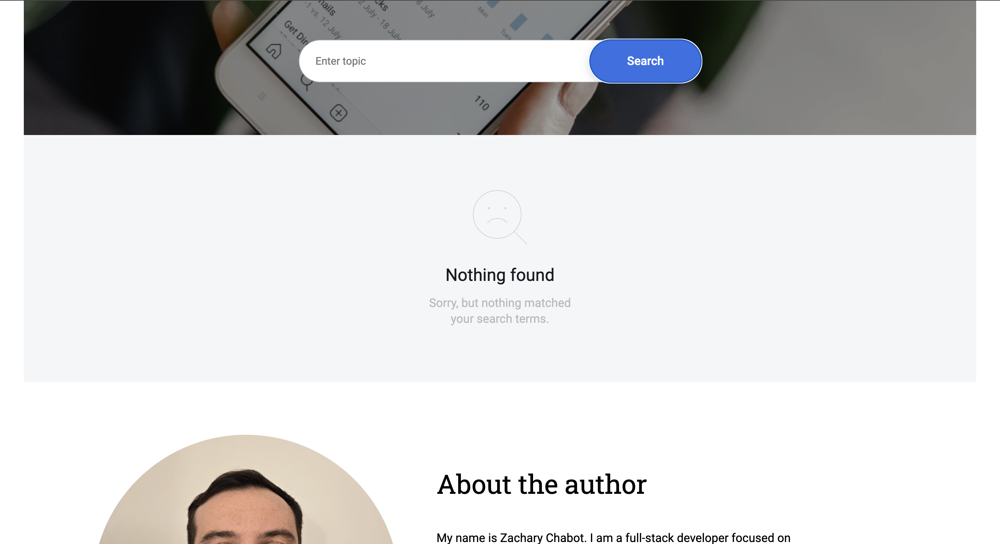
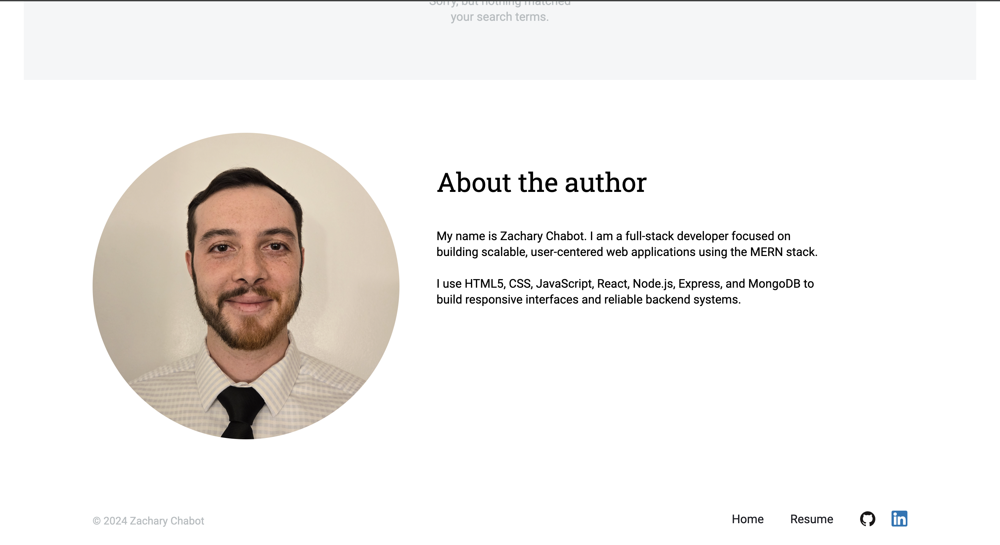
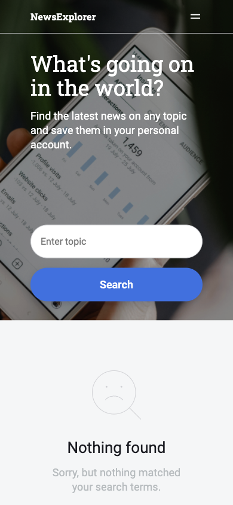
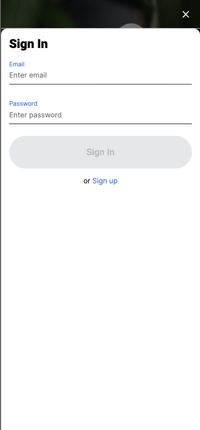
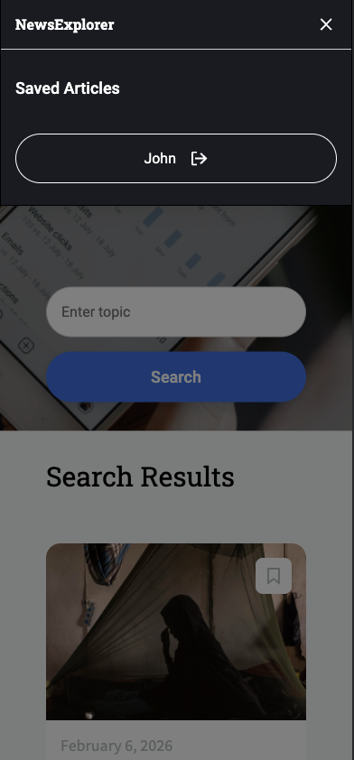
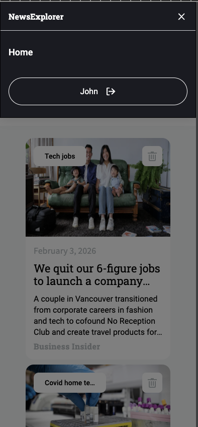
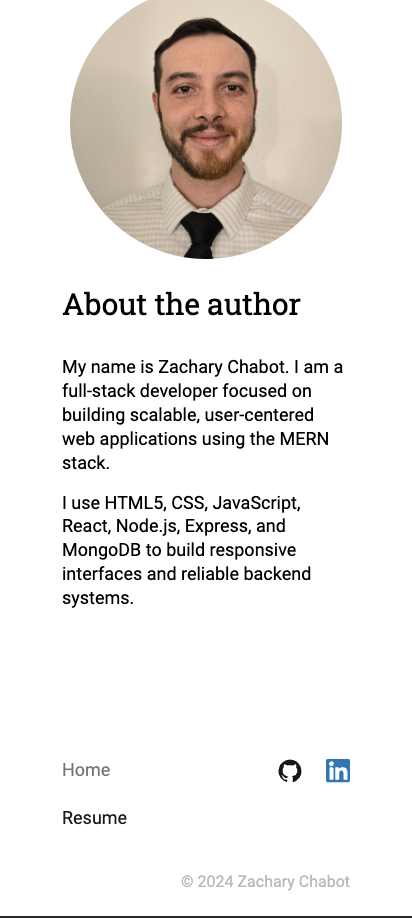

# News Explorer – Frontend

React-based frontend for a full-stack MERN application that allows users to search, save, and manage news articles. The interface communicates with a REST API backend and provides a dynamic, state-driven user experience.

---

## 🌍 Live Demo

https://news-explorer-zc.port0.org

---

## 📸 Screenshots

These screenshots demonstrate the full user flow across desktop and mobile views.













---

## 📌 Overview

The News Explorer frontend enables users to search current news via a third-party API, authenticate into an account, and persistently save articles to their collection. The interface updates dynamically based on backend responses.

---

## 🛠 Tech Stack

- React
- JavaScript (ES6+)
- CSS
- REST API Integration

---

## ✨ Key Features

- Article search using third-party API
- User authentication with protected routes
- Persistent saved articles per user
- Loading states and error handling
- Form validation

---

## ⚙️ Run Locally

### Prerequisites

- Node.js (v23.x recommended — npm included)
- News Explorer backend running (see backend README)

The frontend is configured to connect to the backend at:
http://localhost:3002 when running locally.

### Setup

```bash
git clone https://github.com/Zchabot/news-explorer-frontend.git
cd news-explorer-frontend
npm install
```

### Start Development Server

```bash
npm run dev
```

The app will run at:
http://localhost:3000

### API Configuration

The frontend automatically connects to:

- `http://localhost:3002` during local development
- The deployed backend API in production builds

To use a different backend, update the `baseUrl` configuration in:

`src/utils/constants.js`
